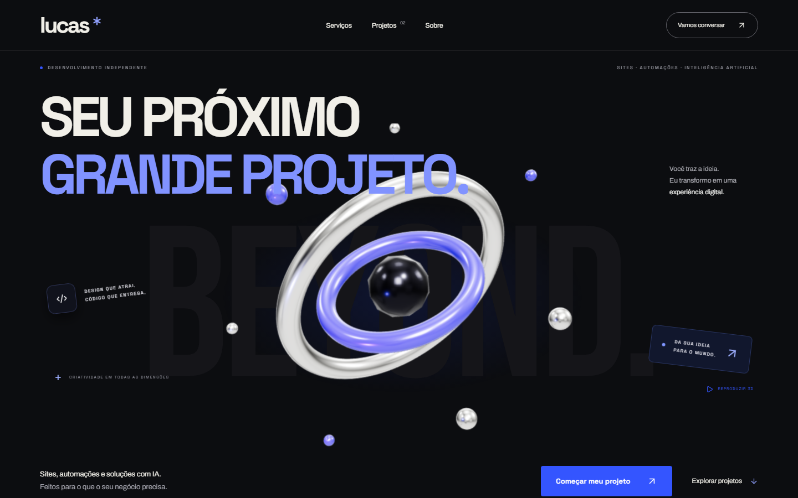
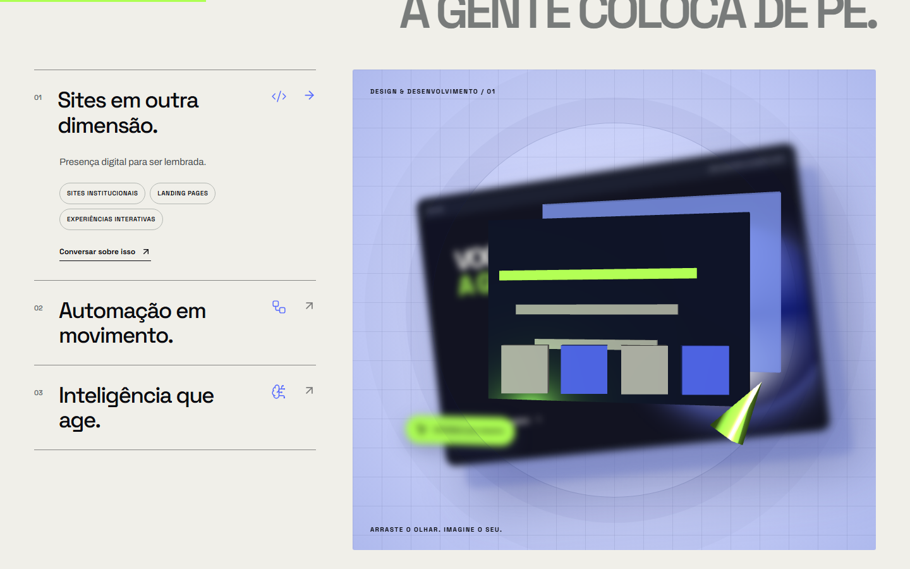
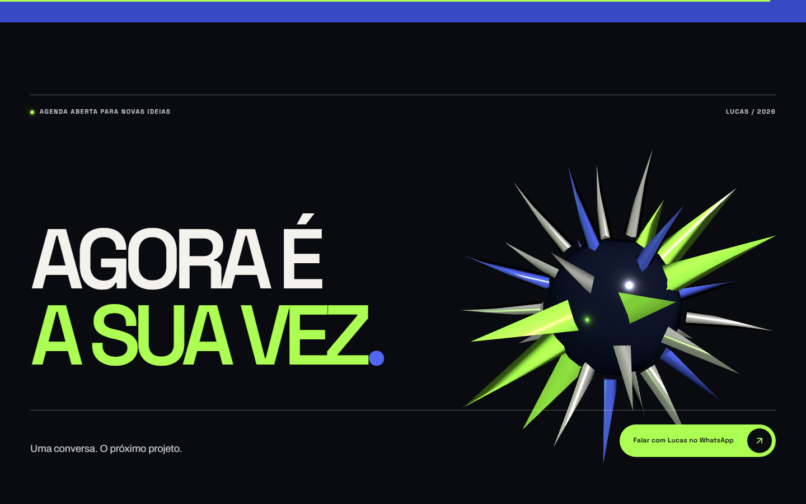

# Lucas Dev Studio

Portfólio de **Lucas**, desenvolvedor de sites, automações e experiências digitais com inteligência artificial. Design com movimento, soluções úteis e contato direto com quem constrói.

**[Conhecer o portfólio](https://luca-dev-studio.pages.dev/)** · **[Pedir um orçamento](https://wa.me/5511965117938?text=Ol%C3%A1%2C%20Lucas%21%20Vi%20seu%20portf%C3%B3lio%20e%20gostaria%20de%20conversar%20sobre%20um%20projeto.)**







## Trabalho em destaque

| Projeto | O que resolve | Tecnologias |
| --- | --- | --- |
| **SANDBOX** | Simulação interativa de decisões financeiras e análise da partida por IA. | JavaScript, Node.js, Azure AI |
| **Sistema Educacional** | Atividades de quiz, forca e caça-palavras com apoio de um tutor de IA. | Python, Tkinter, Azure AI Foundry |

As apresentações desses projetos estão no [portfólio](https://luca-dev-studio.pages.dev/#projetos). O painel do SANDBOX usa uma captura do projeto; a interface do Sistema Educacional é uma representação visual. Este repositório contém o **site do portfólio**, não o código dos dois projetos.

## O que posso construir com você

- **Sites e landing pages** com boa apresentação, responsividade e uma jornada clara até o contato.
- **Automações em Python** para reduzir trabalho repetitivo e organizar processos.
- **Soluções com IA** aplicadas a tarefas concretas, com escopo definido para cada negócio.

Me conte sua ideia pelo [WhatsApp](https://wa.me/5511965117938?text=Ol%C3%A1%2C%20Lucas%21%20Quero%20conversar%20sobre%20um%20projeto.) ou pelo e-mail **contato.lucadevstudio@gmail.com**.

## Este site

Feito com React, TypeScript, Tailwind CSS, Framer Motion e Three.js. O portfólio usa cenas 3D distintas no início, nos serviços, na apresentação pessoal e no contato. O movimento respeita a preferência por movimento reduzido; a animação principal também pode ser pausada. O deploy público usa Cloudflare Pages.

```bash
npm ci
npm run dev
```

Para validar e gerar os arquivos estáticos:

```bash
npm run lint
npm run build
npm test
npm run test:security
```

Node.js 22.12+ é recomendado. Os testes de navegador usam Playwright e podem exigir `npx playwright install chromium` na primeira execução. A saída de publicação está em `dist/`. O build executa uma verificação do conteúdo publicado antes do deploy.

## Organização

- `src/components/new-site.tsx` e `new-site.css`: página comercial, interações e apresentação dos projetos.
- `src/components/digital-sculpture.tsx`, `kinetic-world.tsx` e `sculpture-geometry.ts`: cenas 3D.
- `src/data/projects.ts`: conteúdo dos dois projetos.
- `src/data/contact.ts`: links de contato.
- `public/_headers`: cabeçalhos de segurança no Cloudflare Pages.

O projeto usa a estrutura shadcn com componentes em `src/components/ui`, conforme o alias `@` configurado em `components.json`.

---

**Lucas · Desenvolvimento independente · Brasil**
